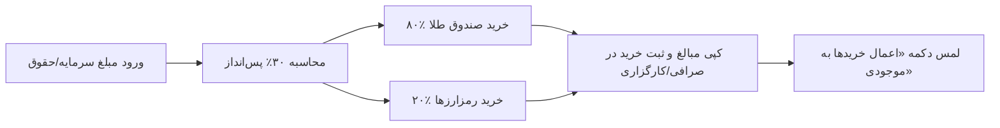

<div align="center">

# 🪙 دستیار هوشمند مدیریت پس‌انداز و سبد سرمایه‌گذاری
### ترکیب طلای بورسی (۸۰٪) و ارزهای دیجیتال (۲۰٪)

<p align="center">
  
  
  
</p>

<p align="center">
  <strong>یک برنامه کاربردی و ساده برای مدیریت پس‌انداز ماهانه، حفظ ارزش پول و ایجاد توازن هوشمند در خرید طلا و ارزهای دیجیتال</strong>
</p>

---

</div>

## 📖 این برنامه دقیقاً چه کاری انجام می‌دهد؟

اگر هر ماه مقداری از درآمد خود را پس‌انداز می‌کنید و می‌خواهید آن را به بهترین شکل سرمایه‌گذاری کنید، این برنامه دستیار شماست:

1. **محاسبه خودکار سهم پس‌انداز**: کافیست کل درآمد یا پول جدید خود را وارد کنید؛ برنامه سهم پس‌انداز (پیش‌فرض: **۳۰٪**) را محاسبه می‌کند.
2. **تقسیم هوشمند بین طلا و کریپتو**: مبلغ پس‌انداز را به نسبت **۸۰٪ طلا** (صندوق‌های معتبر بورس مثل عیار، طلا، کهربا) و **۲۰٪ رمزارزها** (بیت‌کوین، اتریوم، و...) تقسیم می‌کند.
3. **توازن هوشمند دارایی‌ها (Rebalance)**: به موجودی‌های قبلی شما در صرافی و بورس نگاه می‌کند و خرید جدید را طوری پیشنهاد می‌دهد که کل سبد دارایی‌تان دقیقاً به نسبت ایده‌آل برسد.
4. **دستور خرید آماده برای صرافی و کارگزاری**: به شما می‌گوید دقیقاً چند واحد صندوق طلا بخرید و برای هر رمزارز چقدر سفارش بگذارید (با دکمه کپی ۱-لمسی مبالغ).
5. **نرخ‌های لحظه‌ای بازار**: دریافت خودکار و بدون تاخیر قیمت‌های تابلو بورس ایران (TSETMC) و صرافی نوبیتکس.

---

## 📱 صفحات و بخش‌های اصلی برنامه

```
┌─────────────────────────────────────────────────────────────┐
│  📊 داشبورد   🪙 بورس و طلا   ⚡ ارز دیجیتال   💼 دارایی‌ها   ⚙️ تنظیمات  │
└─────────────────────────────────────────────────────────────┘
```

| بخش | کاربرد |
| :--- | :--- |
| **📊 داشبورد** | نمایش ارزش کل دارایی‌ها، نمودار ترکیب سبد، کارت ورودی مبلغ پس‌انداز و دستور خرید پیشنهادی. |
| **🪙 بورس و طلا** | مشاهده قیمت‌های لحظه‌ای صندوق‌های طلای بورس (عیار، طلا، کهربا، زر و...) و مدیریت واحدهای خریداری‌شده. |
| **⚡ ارز دیجیتال** | اتصال به صرافی نوبیتکس، مشاهده مانده ریالی، موجودی کوین‌ها و قیمت‌های لحظه‌ای رمزارزها. |
| **💼 دارایی‌ها** | فهرست جامع تمامی دارایی‌ها به همراه ثبت تاریخچه خریدها. |
| **⚙️ تنظیمات** | تغییر درصد پس‌انداز، نسبت طلا به کریپتو، سهم هر ارز و دریافت فایل پشتیبان. |

---

## 🔑 آموزش گام‌به‌گام اتصال خودکار به نوبیتکس (API Key)

با اتصال کلید API نوبیتکس، برنامه موجودی کیف‌پول‌ها و مانده ریالی شما را به صورت خودکار دریافت می‌کند و دیگر نیازی به وارد کردن دستی تعداد ارزها نخواهید داشت.

> [!IMPORTANT]
> **امنیت ۱۰۰٪ تضمین‌شده است:**  
> دسترسی کلید فقط **«فقط خواندن (READ)»** است؛ یعنی هیچ‌کس (حتی خود برنامه) نمی‌تواند هیچ تراکنش یا برداشتی انجام دهد. کلیدها نیز تنها در حافظه امن گوشی شما نگهداری می‌شوند.

### مراحل ساخت کلید در سایت نوبیتکس:

1. وارد حساب کاربری خود در سایت [Nobitex.ir](https://nobitex.ir) شوید.
2. روی عکس پروفایل خود در بالای صفحه بزنید و وارد بخش **پروفایل > کلیدهای API** (یا لینک مستقیم: [nobitex.ir/panel/api-keys](https://nobitex.ir/panel/api-keys)) شوید.
3. روی دکمه **«ایجاد کلید جدید»** کلیک کنید.
4. در پنجره بازشده:
   - یک عنوان دلخواه وارد کنید (مثلاً: `Investment App`).
   - در بخش دسترسی‌ها، **فقط تیک گزینه «خواندن (Read)»** را فعال کنید.
   - **تیک دسترسی‌های واریز، برداشت یا معامله را به هیچ عنوان فعال نکنید.**
5. پس از تایید با پیامک یا کد دو مرحله‌ای، نوبیتکس دو کلید به شما نمایش می‌دهد:
   - **کلید عمومی (API Key / Public Key)**
   - **کلید خصوصی (Secret Key / Private Key)**
6. وارد اپلیکیشن مدیریت سرمایه شوید، تب **«ارز دیجیتال»** را باز کنید و دکمه **«اتصال به نوبیتکس»** را لمس کنید.
7. کلید عمومی و خصوصی را در کادرهای مربوطه الصاق کرده و دکمه **«ذخیره و همگام‌سازی»** را بزنید.

🎉 **تبریک!** موجودی تمامی رمزارزها و مانده ریالی شما هم‌اکنون به صورت زنده همگام‌سازی می‌شود.

---

## 💡 راهنمای استفاده سریع



1. در تب **داشبورد**، مبلغی که قصد دارید پس‌انداز کنید (مثلاً ۲۰ میلیون تومان) را در کادر ورودی وارد کنید.
2. برنامه حروف‌خوانی مبلغ (`بیست میلیون تومان`) و سهم‌های پیشنهادی را برای طلا و کریپتو نمایش می‌دهد.
3. جدول **«دستور خرید هوشمند»** به شما مبالغ دقیق را نشان می‌دهد.
4. روی آیکون کپی در کنار هر ارز بزنید و خرید خود را در صرافی یا کارگزاری انجام دهید.
5. در پایان، دکمه سبز رنگ **«اعمال خریدها به موجودی»** را بزنید تا خریدهای جدید به کل دارایی‌های شما افزوده شوند.

---

## 📲 نحوه دریافت و نصب برنامه روی گوشی

### 🤖 برای کاربران گوشی‌های اندروید (Android):
1. از ستون سمت راست یا بالای همین مخزن گیت‌هاب وارد بخش **[Releases](../../releases)** شوید.
2. آخرین نسخه فایل نصبی با پسوند **`.apk`** (مانند `Investment-App-v1.0.X.apk`) را دانلود کرده و مستقیماً روی گوشی خود لمس و نصب نمایید.

---

### 🍏 برای کاربران آیفون و آیپد (iOS):

#### روش ۱ (ساده‌ترین روش - بدون نیاز به رایانه و ۱۰۰٪ رایگان):
1. لینک مستقیم وب‌اپلیکیشن: **[investment-app-mu-five.vercel.app](https://investment-app-mu-five.vercel.app/)** را در مرورگر **Safari** آیفون باز کنید.
2. دکمه **Share** (آیکون اشتراک‌گذاری مربع و فلش در پایین صفحه) را لمس کنید.
3. گزینه **Add to Home Screen (افزودن به صفحه اصلی)** را انتخاب کنید.
   *(برنامه بدون نیاز به هیچ گواهی یا تمدید، مانند یک اپ بومی با آیکون اختصاصی و عملکرد آفلاین اجرا می‌شود).*

#### روش ۲ (نصب فایل نصبی بومی IPA):
1. از بخش **[Releases](../../releases)** فایل با پسوند **`.ipa`** (مانند `Investment-App-v1.0.X.ipa`) را دانلود کنید.
2. با یکی از نرم‌افزارهای رایگان و محبوب زیر فایل را روی آیفون خود نصب کنید:
   - **Sideloadly** (نرم‌افزار رایگان ویندوز و مک - نصب مستقیم با کابل USB)
   - **AltStore** یا **SideStore** (نصب و تمدید خودکار روی آیفون)

---

## 🛡️ حریم خصوصی و امنیت

- **بدون نیاز به ثبت نام و ورود**: برنامه بدون ایمیل یا شماره موبایل کار می‌کند.
- **ذخیره ۱۰۰٪ محلی**: تمام داده‌ها در خود گوشی شما ذخیره شده و به هیچ سرور شخصی ارسال نمی‌شود.
- **پشتیبان‌گیری آسان**: در صفحه تنظیمات می‌توانید در هر زمان از تمامی داده‌های خود یک فایل پشتیبان دریافت کرده و در صورت تعویض گوشی آن را بازیابی کنید.

---

<div align="center">
  <sub>طراحی‌شده با عشق برای سرمایه‌گذاران هوشمند ایرانی 🇮🇷</sub>
</div>
